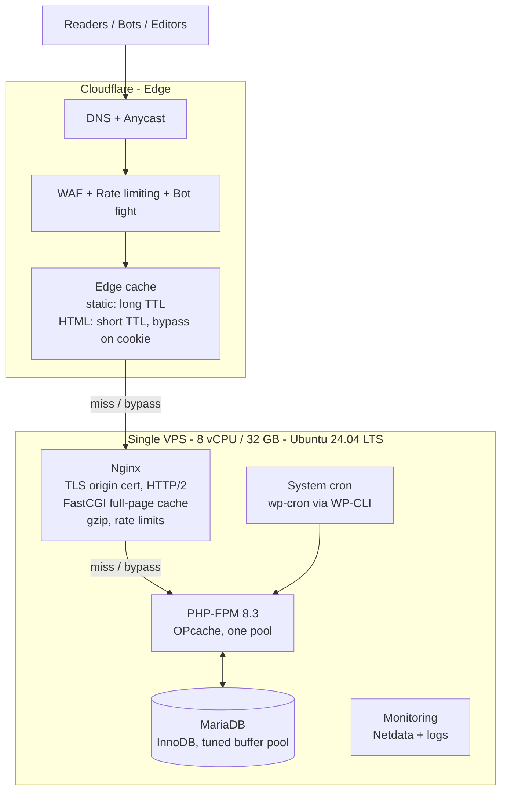
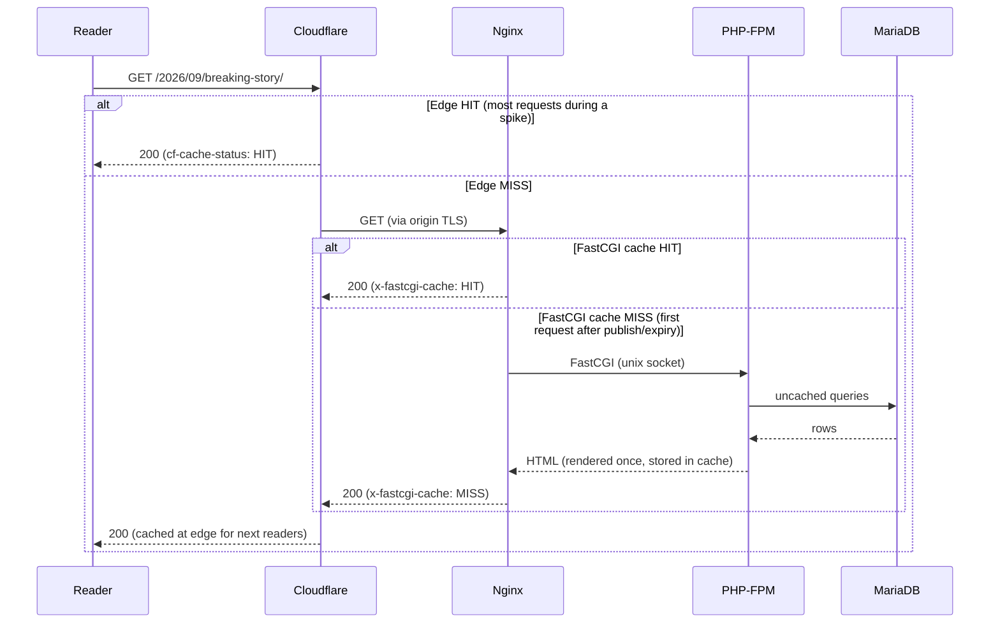

# 02 — Architecture Overview

## The stack

Only origin ports 80/443 are reachable from the internet (lock them to Cloudflare IP
ranges after cut-over). MariaDB listens on localhost. SSH is rate-limited.

## Request flow — anonymous reader (the 99 % case)

Key behaviours:

- **Cache stampede protection.** `fastcgi_cache_lock` ensures only *one* request renders
  a page after expiry; others wait a few ms or get the stale copy.
- **Stale-while-revalidate.** `fastcgi_cache_background_update` + `fastcgi_cache_use_stale`
  serve the old page instantly while refreshing in the background.
- **Serve-stale-on-error.** If PHP-FPM is overwhelmed or MariaDB is down, Nginx keeps
  serving the last good copy (`use_stale error timeout http_500 http_503`).
  Readers see a working site while we fix the backend.

## Request flow — editor (the 1 % case)

Editors have a `wordpress_logged_in_*` cookie. That cookie:

1. Makes Cloudflare **bypass** its HTML cache (Cache Rule: bypass when cookie matches).
2. Makes Nginx **bypass** the FastCGI cache (`fastcgi_cache_bypass` / `fastcgi_no_cache`).
3. Hits the **same PHP-FPM pool** as cache misses. Editor load is small; keep plugin
   count and heartbeat in check so a heavy admin action cannot starve a purge storm.

wp-admin, wp-login.php, REST API writes, and `POST` requests are never cached.

## Component responsibilities

| Component | Responsible for | Explicitly NOT responsible for |
|-----------|-----------------|-------------------------------|
| **Cloudflare** | DNS, DDoS absorption, WAF, bot mitigation, TLS to readers, caching static assets ~forever, caching HTML briefly, image resizing (Polish/Mirage optional) | Being the source of truth for cache state |
| **Nginx** | TLS from Cloudflare (origin cert), full-page cache, gzip, static file serving, rate limiting on `wp-login.php` / `xmlrpc.php` | Running any application logic |
| **PHP-FPM** | Rendering the pages that missed both caches; wp-admin; REST API | Serving static files |
| **MariaDB** | Source of truth | Handling read traffic that the page cache could absorb |
| **System cron** | Running `wp cron event run --due-now` every minute; cache warmers; backups | — |

## Why this shape and not something else

- **Two cache tiers (edge + origin)** because Cloudflare protects against volume and
  geography, while the Nginx cache protects against Cloudflare's imperfect hit ratio
  (many PoPs each with their own cache, short TTLs, purge propagation).
- **Nginx FastCGI cache instead of Varnish** because it removes a whole process and hop,
  is trivially reliable, and WordPress doesn't need ESI when dynamic fragments are done
  client-side. Full comparison in doc 05.
- **No Redis object cache.** Cache hits never reach PHP. Misses and editors still hit
  MariaDB, but the volume is small enough that a tuned InnoDB buffer pool is enough.
  Object cache remains an option later if miss TTFB is the bottleneck (doc 05 Q3).
- **Native packages** (doc 05 Q5). Unix sockets (nginx ↔ PHP-FPM, PHP ↔ MariaDB),
  Ubuntu's nginx/PHP/MariaDB, and `www-data` owning both the cache dir and FPM so the
  purge plugin can delete cache files with no extra module.
