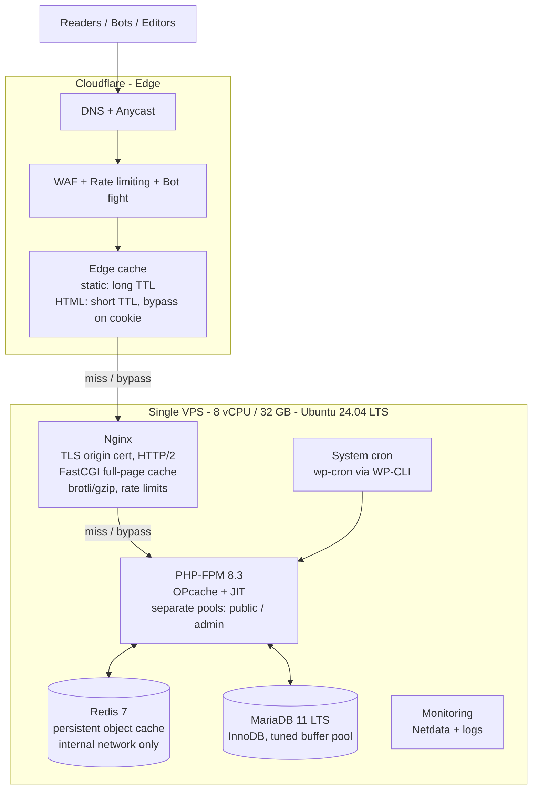
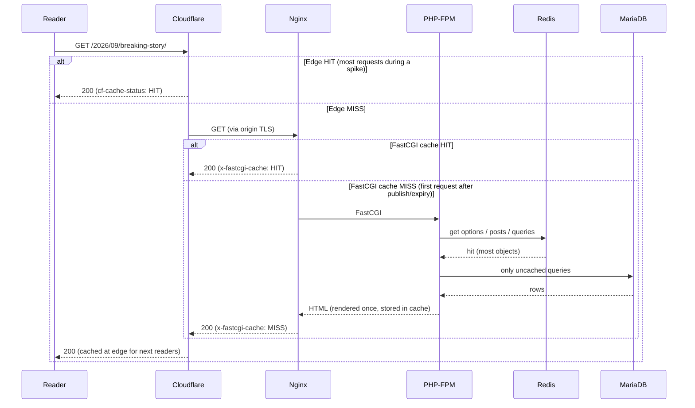

# 02 — Architecture Overview

## The stack

Only origin ports 80/443 are reachable, and only from Cloudflare IP ranges. Everything
else (SSH, DB, Redis) is firewalled or reachable only on the internal Docker network.

## Request flow — anonymous reader (the 99 % case)

Key behaviours:

- **Cache stampede protection.** `fastcgi_cache_lock` ensures only *one* request renders
  a page after expiry; others wait a few ms or get the stale copy.
- **Stale-while-revalidate.** `fastcgi_cache_background_update` + `fastcgi_cache_use_stale`
  serve the old page instantly while refreshing in the background.
- **Serve-stale-on-error.** If PHP-FPM is overwhelmed or MariaDB is down, Nginx keeps
  serving the last good copy (`use_stale error timeout http_500 http_503`).
  Readers see a working site while we fix the backend.

## Request flow — editor (the 1 % case)

Editors have a `wordpress_logged_in_*` cookie. That cookie:

1. Makes Cloudflare **bypass** its HTML cache (Cache Rule: bypass when cookie matches).
2. Makes Nginx **bypass** the FastCGI cache (`fastcgi_cache_bypass` / `fastcgi_no_cache`).
3. Routes to a **dedicated PHP-FPM pool** (`admin`) so a heavy admin operation cannot
   starve the public pool that handles cache misses.

wp-admin, wp-login.php, REST API writes, and `POST` requests are never cached.

## Component responsibilities

| Component | Responsible for | Explicitly NOT responsible for |
|-----------|-----------------|-------------------------------|
| **Cloudflare** | DNS, DDoS absorption, WAF, bot mitigation, TLS to readers, caching static assets ~forever, caching HTML briefly, image resizing (Polish/Mirage optional) | Being the source of truth for cache state |
| **Nginx** | TLS from Cloudflare (origin cert), full-page cache, gzip/brotli, static file serving, rate limiting on `wp-login.php` / `xmlrpc.php`, blocking non-Cloudflare traffic | Running any application logic |
| **PHP-FPM** | Rendering the pages that missed both caches; wp-admin; REST API | Serving static files |
| **Redis** | WordPress object cache (queries, options, transients), reducing DB load 70–90 % | Full-page cache (we deliberately keep that in Nginx) |
| **MariaDB** | Source of truth | Handling read traffic that Redis or page cache could absorb |
| **System cron** | Running `wp cron event run --due-now` every minute; cache warmers; backups | — |

## Why this shape and not something else

- **Two cache tiers (edge + origin)** because Cloudflare protects against volume and
  geography, while the Nginx cache protects against Cloudflare's imperfect hit ratio
  (many PoPs each with their own cache, short TTLs, purge propagation).
- **Nginx FastCGI cache instead of Varnish** because it removes a whole process and hop,
  is trivially reliable, and WordPress doesn't need ESI when dynamic fragments are done
  client-side. Full comparison in doc 05.
- **Redis object cache in addition to page cache** because cache misses and editor
  requests still hit PHP, and WordPress makes 50–200 queries per uncached page.
  Redis turns those into microsecond lookups.
- **Docker Compose** for the whole stack (decided, doc 05 Q5). Cache hits never leave
  nginx, so the container network hop only affects the ~1–5 % of requests that reach PHP.
  nginx workers and PHP-FPM share the same uid (82), which lets WordPress purge the nginx
  cache by deleting files on a shared volume — no custom nginx module needed.
